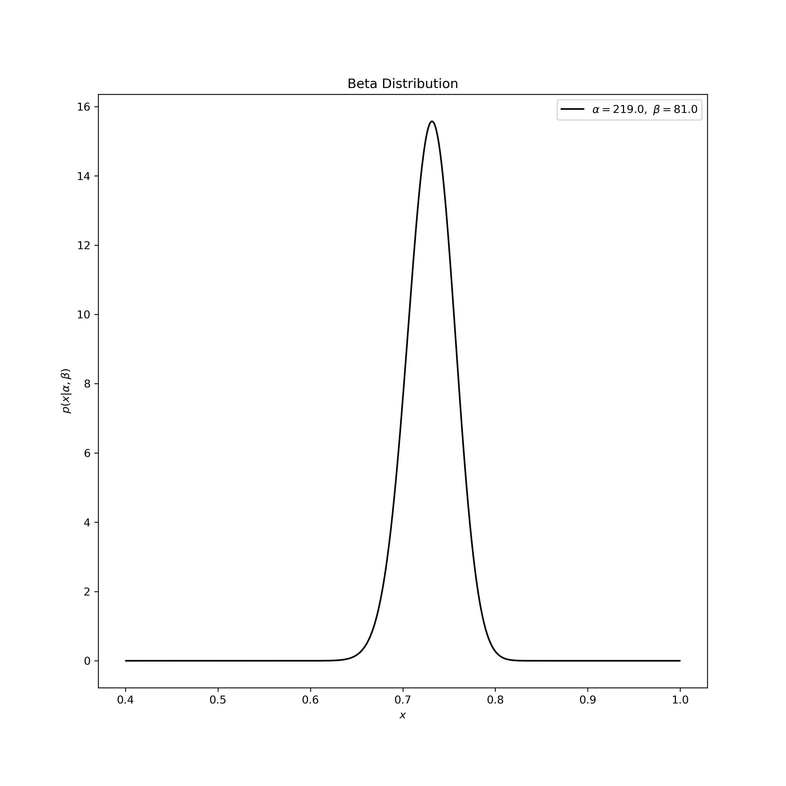
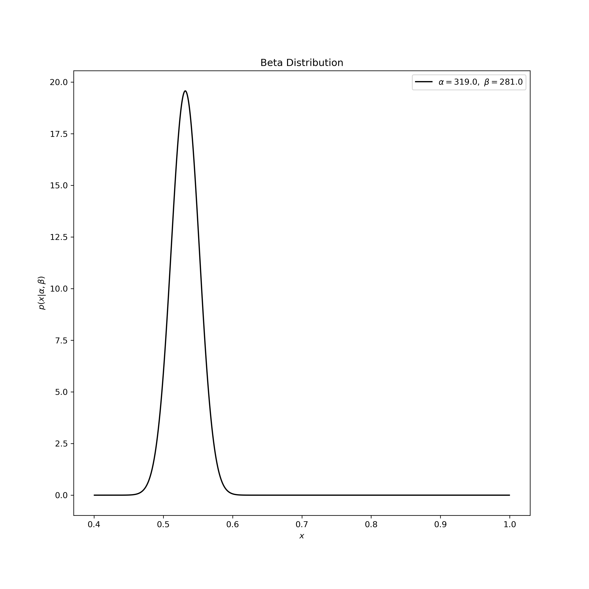

# Stochastic Multi-Armed Bandit Problem

**Assumptions**. We are given a slot machine with N arms. At each time step t=1, 2, 3, etc. we must pick one of the N arms to play. When played, each arm yields a random real-valued reward according to a fixed but **unknown** distribution.

- The reward's distribution has support in [0, 1].
- The random rewards obtained from playing an arm repeatedly are i.i.d. and
independent of the plays of the other arms.
- We obtain the reward immediately after playing the arm.

We need to develop an algorithm that can decide which arm to play at each time step t, based on the outcomes of the previous t-1 plays.

## Beta Distribution

We need to think of the Beta distribution as representing a distribution of probabilities, that is, it represents all the possible values of a probability when we don't know what that probability is.

Imagine that we're trying to predict the free throw percentage (FTP) of Lebron James for the season. We could use his historical FTP from all past seasons, but this would be a very poor measure at the start of the season. If LBJ shoots 1 free throw and makes it, his FTP will be 1.000 but if he misses, it will be 0.000. This doesn't get better if he shoots 5-6 free throws. He could get a really lucky streak of 1.000 or a very unlucky streak of 0.000, neither of which are a remotely good predictor of how LBJ will shoot that season.

So why is the FTP in the first few games a bad predictor of the eventual FTP? Think about yourself. Why do you not automatically assume that LBJ is gonna shoot really poorly this season after a few missed ones? Conversely, why do you not assume that Shaq will have a stellar FTP for a season when he luckily makes the first few? The answer: because we're going in with *prior expectations*. We know that in history, most FTP over a season have hovered between something like .700 and .800, with some extremely rare exceptions on either side. We know that if a player gets a few misses in a row at the start, that might indicate he'll end up a bit worse than average, but we know he probably won't deviate from that range.

Given our free throw percentage average, which can be represented with a binomial distribution (a series of successes and failures), the best way to represent these prior expectations (called priors) is with the Beta distribution: it's saying that before we've seen the player shoot the ball, what we roughly expect his FTP to be. The domain of the Beta distribution is `[0, 1]`, just like a probability so we know we're on the right track - but its appropriateness goes far beyond this, as we'll see in a bit.

We expect that LBJ's season-long FTP will be most likely around `0.72`, but that it could reasonably range from `.65` to `.78`. This can be represented with a Beta distribution with parameters `alpha=219` and `beta=81`:

 

How did we come up with these parameters:

* The mean is `alpha / (alpha + beta) = 219 / (219 + 81) = 0.73`
As you can see in the plot, this distribution lies almost entirely within (.66, .80).

Notice how both the y-axis and the x-axis represent probabilities: the x-axis represents the free-throw percentage while the y-axis represents a probability density function. This goes back to the point saying that the Beta distribution is a distribution over probabilities.

Now here's why the Beta distribution is such an appropriate choice for a Binomial prior: Imagine LBJ makes his first free throw. His record for the season will be:

* free throw made: 1
* free throw attempted: 1

We have to then update our probabilities - we want to shift this entire curve over just a bit to reflect our new information. While the math for proving this is a bit involved, the result is very simple. The new Beta distribution will be Beta(`alpha_0` + made, `beta_0` + missed), where `alpha_0` and `beta_0` are the initial estimates. So the new distribution is Beta(220, 81):

 

Notice that this barely changes the curve (indeed it is invisible to the naked eye). However, the more the player hits over the course of the season the more the curve will shift to accomodate the new evidence, and furthermore the more it will narrow based on the fact that we have more proof. In fact, the more we are sure, the more the beta curve thins and shifts to a specific probability.

Let's say that towards the middle of the season, LBJ has gone up to shoot 300 FT and made only 100 out of those (this is a fake scenario, the GOAT would never miss that many). The new Beta distribution will be Beta(219 + 100, 81 + 200).

 

Notice the curve is now both thinner and shifted to the left (lower FTP) than it used to be -- we have a better sense of what his FTP average will look like for the rest of the season.

One of the most interesting things about

## Thompson Sampling

How does all this apply to our problem?

We have two (more generally N) neural networks outputting poses and associated probabilities for a given bin configuration at time step t. For each network, we select the pose with the highest confidence. Now, we need a way of selecting between the different network poses. The naive -- and our current -- way of doing this is to select the action with the highest confidence. Without some sort of normalization, this leads to suboptimal behavior. This is because one of the networks is super confident (0.9+) while the other is more conservative which means it will always pick the same network at every time step.

At each time step, we would like to pick the network (not necessarily the one with the highest probability) that maximizes the probability of clearing a bin. We can view this as a 2-arm bandit problem where the reward for each success is in the range [0, 1].

## References

- [Intuition behind the Beta distribution](https://stats.stackexchange.com/questions/47771/what-is-the-intuition-behind-beta-distribution)
- [Thompson Sampling](http://proceedings.mlr.press/v23/agrawal12/agrawal12.pdf)
- [Code](https://github.com/lilianweng/multi-armed-bandit)
- [A/B Testing](https://en.wikipedia.org/wiki/A/B_testing)
- [Thompson Sampling](https://arxiv.org/pdf/1707.02038.pdf)
